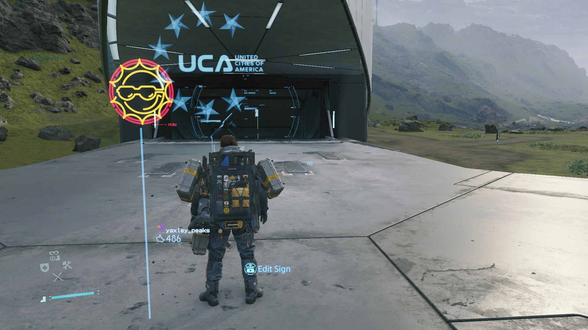

8/5/2024 

I really like things that do passive communication. These "things" have mostly
been games but there's a couple more.

The Soulsbourne games, Minecraft (putting down a sign) and Death stranding,
where you can leave messages for other players for them to find later.  Even low
traffic websites where I can leave comments for maybe someone else to find some
day. I have also found similar comfort in BBSes and old-style leisurely
mailing-lists. Even bathroom graffiti counts :)

There is something extremely comforting about this I really like this and I wish
more things did this. 
